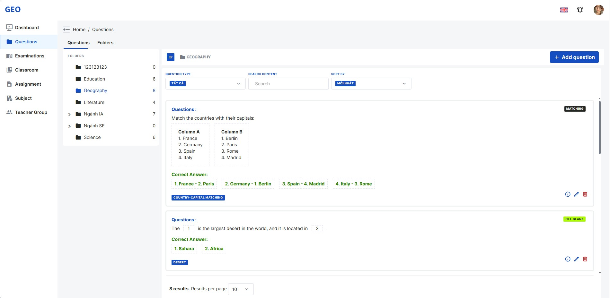

# GEO (Guardian Exam Online)

```
  _____                     _ _             ______                      ____        _ _
 / ____|                   | (_)           |  ____|                    / __ \      | (_)
| |  __ _   _  __ _ _ __ __| |_  __ _ _ __ | |__  __  ____ _ _ __ ___ | |  | |_ __ | |_ _ __   ___
| | |_ | | | |/ _` | '__/ _` | |/ _` | '_ \|  __| \ \/ / _` | '_ ` _ \| |  | | '_ \| | | '_ \ / _ \
| |__| | |_| | (_| | | | (_| | | (_| | | | | |____ >  < (_| | | | | | | |__| | | | | | | | | |  __/
 \_____|\__,_|\__,_|_|  \__,_|_|\__,_|_| |_|______/_/\_\__,_|_| |_| |_|\____/|_| |_|_|_|_| |_|\___|
```

<p align="center">
  <a href="#" target="_blank">
    
  </a>
</p>

<p align="center">
  Free and efficient Online Exam System utilizing modern web technologies for secure and streamlined exam processes.</br>
  Developed by GEO Team.</br>
  Based on innovative web solutions.
</p>

<p align="center">
  <a href="https://guardianexam.com"> Live Demo </a> |
  <a href="#"> About GEO </a> |
  <a href="#">GEO Documentation</a>
</p>

> GEO is built with modern web technologies. See our
> <a href="#">issues</a>,
> <a href="#">contributing guide</a> and join discussions on our
> <a href="#">Community Forum</a> to help us improve GEO.

<p align="center">
  <a href="#" target="_blank">
    
  </a>
</p>

### Quick start

Use the following command to quickly start GEO project.

```bash
git clone git@gitlab.com:guardian-exam-online/geo-vue-managerment-fe.git
cd GEO-VUE-MANAGERMENT-FE
npm install
npm run dev
```
